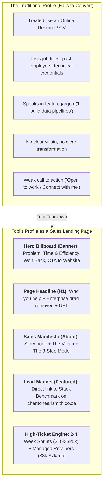
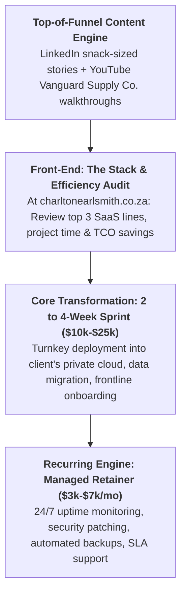

# Charlton Smith — Master Business & Content Strategy (30-Day Execution Engine)
## Enterprise Open Source Transformation & Managed Infrastructure Retainers

> **Canonical Lead Destination**: [charltonearlsmith.co.za](https://charltonearlsmith.co.za)  
> **Target Audience**: Growing, busy mid-market companies (50–500 employees) with healthy operating budgets who are losing time, speed, and efficiency fighting bloated enterprise software.  
> **Brand Methodology**: Built upon Tobi Oluwole's B2B organic growth frameworks (*"How I Got 400,000 Followers & Made $6M"* and live profile teardowns).

---

## 1. Executive Summary & Positioning

| Strategic Pillar | Definition & Execution |
| :--- | :--- |
| **Core Value Proposition** | We replace rigid, predatory enterprise software (Power BI, Zapier, Salesforce, Datadog) with clean, high-speed Open Source systems tailored to how your business actually runs—implemented in 2 to 4 weeks and backed by a 24/7 managed infrastructure retainer. |
| **Target Audience** | Busy mid-market business owners, CEOs, COOs, and Managing Directors who want to **win back time, control, and operational speed** (NOT cheapskates looking for free software). |
| **Tool Policy** | **Strictly NO open-source tool names in public marketing** (No DuckDB, n8n, SigNoz, Odoo, Twenty, etc.). Call out the proprietary enterprise vendor, focus on the business outcome, and emphasize the managed retainer. |
| **Lead Engine** | Every post, video description, banner, and profile section directs qualified prospects to **[charltonearlsmith.co.za](https://charltonearlsmith.co.za)** for stack and operational audits. |

---

## 2. Insights from Tobi Oluwole’s Live Client Profile Teardown

In his live client audits (e.g., *"I built a $20k/month LinkedIn strategy for her in 24 minutes"*), Tobi deconstructs why 99% of B2B profiles fail to generate revenue and how to re-architect them:



### Key Principles from Tobi's Client Reviews:
1. **The Headline is your H1 Hook**: Prospects give you 3 seconds. If your headline says *"Data Architect & Consultant"*, you are a commodity. If it says *"Helping busy mid-market businesses win back time & operational efficiency with production-grade Open Source"*, you are a high-value strategic transformation partner.
2. **Eliminate the "Consultant's Curse" (Over-complicating the tech)**: Clients do not care what database or workflow engine you use. They care that **they stop wasting 15 hours a week on manual spreadsheets**, **stop paying $14/user/month to view reports**, and **regain control of their systems**.
3. **The $20k–$50k/Month High-Ticket Packaging Math**:
   * Instead of small hourly gigs, package a **Turnkey Transformation Sprint** ($10,000 to $25,000 fixed price) followed by a **Managed Open Infrastructure Retainer** ($3,000 to $7,000/month).
   * Just 4 active retainer clients generate **$15k–$25k/month in recurring, predictable revenue**, completely eliminating the feast-and-famine cycle.

---

## 3. The 8 Operational Transformation Domains

| Operational Domain | The Enterprise SaaS Drag (Called Out) | The Open Source Business Transformation |
| :--- | :--- | :--- |
| **1. Business Intelligence & Reporting** | Power BI, Tableau, Snowflake | Instant executive and frontline dashboards directly on your private cloud with **zero per-seat limits**. Put real-time numbers in front of every decision-maker. |
| **2. Workflow Automations & Integrations** | Zapier, Make, Workato | High-capacity automation pipelines connecting your systems with **unlimited execution steps and zero per-task penalties**. |
| **3. CRM & Lead Management** | Salesforce, HubSpot Enterprise | Streamlined customer relationships and pipeline tracking tailored to your exact sales process with **100% data ownership and zero per-seat user fees**. |
| **4. Invoicing & Revenue Management** | Stripe Billing enterprise tiers, Chargebee, QuickBooks seat locks | Clean recurring billing, automated dunning, and multi-currency invoicing with **zero platform percentage take-rates**. |
| **5. Transportation, Fleet & Logistics** | Samsara, Geotab, proprietary TMS subscriptions | Real-time GPS tracking, dispatch routing, delivery manifests, and fleet telemetry with **zero monthly per-vehicle software fees**. |
| **6. E-Commerce & Digital Commerce** | Shopify Plus ($2,500/mo + % cut), Adobe Commerce | High-speed B2B wholesale portals and digital storefronts with **complete customer database ownership and zero transaction cuts**. |
| **7. Infrastructure Monitoring & Observability** | Datadog, New Relic, Splunk | Unified system visibility, log aggregation, and error tracing with **zero surprise volume spike invoices**. |
| **8. Internal Portals & Operational Tools** | Retool Enterprise, custom proprietary software | Custom frontline inventory screens, dispatch tablets, and operational tools built around your exact workflow with **zero user license caps**. |

---

## 4. The 3-Tier Commercial Delivery Flywheel



---

## 5. The 3 Core Channels (Integrated Architecture)

### Channel 1: The charltonearlsmith.co.za Website Funnel
* **Role**: The centralized conversion hub. Simple, authoritative, lightning-fast one-page executive funnel.
* **Key Components**:
  * Hero hook: *"Win Back Time & Operational Efficiency. Zero Enterprise Software Drag."*
  * The 3 SaaS friction cards (Seat rationing, growth penalties, 14-click bloat).
  * The 8 Operational Transformation Domains.
  * Embedded YouTube walkthrough (*"The Whiteboard in the Warehouse"*).
  * Interactive 48-Hour Stack & Efficiency Audit booking form.
* **Code Deliverable**: [`website/index.html`](file:///c:/Users/G988557/Documents/Code/antigravity/opensourcetransformation/website/index.html)
* **Funnel Specification**: [`website/charltonearlsmith_website_funnel_specification.md`](file:///c:/Users/G988557/Documents/Code/antigravity/opensourcetransformation/website/charltonearlsmith_website_funnel_specification.md)

### Channel 2: The LinkedIn Thought Leadership Engine
* **Role**: Daily weekday top-of-funnel attention and authority building.
* **Format**: Snack-sized (8–12 lines), one thought per line, zero open-source names, direct call-outs of enterprise software friction, direct CTA to `charltonearlsmith.co.za`.
* **Profile Setup**: Headline Option A + Story-driven About Manifesto in [`brand/brand_and_profile_overhaul.md`](file:///c:/Users/G988557/Documents/Code/antigravity/opensourcetransformation/brand/brand_and_profile_overhaul.md).
* **Week 1 Calendar**: [`posts/week_01_content_calendar.md`](file:///c:/Users/G988557/Documents/Code/antigravity/opensourcetransformation/posts/week_01_content_calendar.md).

### Channel 3: The YouTube Narrative Engine (Vanguard Supply Co.)
* **Role**: Deep executive trust, proof of capability, and high-ticket client conversion.
* **Format**: Real software walkthroughs in the life of a fictional $35M distributor (**Vanguard Supply Co.**). **Strictly NO CLI commands, Linux terminal scripts, or GitHub install tutorials.**
* **Strategy & Universe Spec**: [`videos/youtube_channel_strategy_and_narrative_universe.md`](file:///c:/Users/G988557/Documents/Code/antigravity/opensourcetransformation/videos/youtube_channel_strategy_and_narrative_universe.md).
* **Episode 1 Script**: [`videos/season_01/episode_01_the_whiteboard_in_the_warehouse.md`](file:///c:/Users/G988557/Documents/Code/antigravity/opensourcetransformation/videos/season_01/episode_01_the_whiteboard_in_the_warehouse.md).

---

## 6. The 30-Day Master Execution Walkthrough

```
+----------------------------------------------------------------------------------------------------+
| 30-DAY EXECUTION TIMELINE                                                                          |
+--------------------------+-------------------------------------------------------------------------+
| Phase 1: Days 1 to 7     | Foundations Live (Website Funnel, Profile Overhaul & Episode 1 Launch)  |
| Phase 2: Days 8 to 14    | Content Engine Rhythm & First Stack Audit Intakes                       |
| Phase 3: Days 15 to 21   | Audit Delivery, Strategy Calls & Episode 2 Launch                       |
| Phase 4: Days 22 to 30   | Closing Initial Turnkey Sprints & Activating Managed Retainers         |
+--------------------------+-------------------------------------------------------------------------+
```

### Phase 1: Days 1 to 7 — Foundations Live & Launch

#### Day 1 (Website Funnel Deployment):
* Deploy the updated executive landing page to **[charltonearlsmith.co.za](https://charltonearlsmith.co.za)** using [`website/index.html`](file:///c:/Users/G988557/Documents/Code/antigravity/opensourcetransformation/website/index.html).
* Test the interactive audit request form and lead notification routing.

#### Day 2 (LinkedIn Profile as a Landing Page):
* Update LinkedIn Banner using [`brand/banner/linkedin_banner.html`](file:///c:/Users/G988557/Documents/Code/antigravity/opensourcetransformation/brand/banner/linkedin_banner.html).
* Paste **Headline Option A** from [`brand/brand_and_profile_overhaul.md`](file:///c:/Users/G988557/Documents/Code/antigravity/opensourcetransformation/brand/brand_and_profile_overhaul.md):
  > *Helping busy mid-market businesses win back time & operational efficiency with production-grade Open Source | No jargon. Implemented, tailored & managed for you | charltonearlsmith.co.za*
* Paste the story-driven **About Manifesto** and set Featured links directly to `charltonearlsmith.co.za`.

#### Day 3 (YouTube Setup & B-Roll Planning):
* Set up YouTube Channel branding (*Charlton Smith — Enterprise Open Source for Business*).
* Prepare screen recording environment for Episode 1 (*"The Whiteboard in the Warehouse"*).

#### Day 4 (Recording Episode 1):
* Record screen walkthrough of the modern analytics portal and floor supervisor tablet following [`videos/season_01/episode_01_the_whiteboard_in_the_warehouse.md`](file:///c:/Users/G988557/Documents/Code/antigravity/opensourcetransformation/videos/season_01/episode_01_the_whiteboard_in_the_warehouse.md).
* Record on-camera hook and outro.

#### Day 5 (Launch Episode 1 & Post 1):
* Publish Episode 1 on YouTube with full timestamps and audit link to `charltonearlsmith.co.za`.
* Publish **Post 1** from [`posts/week_01_content_calendar.md`](file:///c:/Users/G988557/Documents/Code/antigravity/opensourcetransformation/posts/week_01_content_calendar.md) on LinkedIn at 08:00 AM.

#### Days 6 & 7 (Targeted Executive Outreach):
* Connect with 30 mid-market CEOs, COOs, and Managing Directors (50–500 staff in distribution, supply chain, and subscription business).
* Leave insightful, non-sales comments on 5 industry executive posts.

---

### Phase 2: Days 8 to 14 — Daily Content Rhythm & First Audits

#### Days 8 to 12 (Daily LinkedIn Content):
* Publish Posts 2 through 6 from [`posts/week_01_content_calendar.md`](file:///c:/Users/G988557/Documents/Code/antigravity/opensourcetransformation/posts/week_01_content_calendar.md) at 08:00 AM sharp:
  * Tuesday: Frontline Whiteboard Story (Power BI seat tax).
  * Wednesday: The Sales Seat Tax (Salesforce bloat).
  * Thursday: Fleet Telematics (Samsara per-vehicle fee).
  * Friday: The Subscription Billing Percentage Heist.
* Each post drives traffic directly to `charltonearlsmith.co.za`.

#### Day 10 (Review Inbound Audit Submissions):
* Review first batch of audit submissions from `charltonearlsmith.co.za`.
* Run quick preliminary TCO and workflow bottleneck calculation for qualified leads.

#### Day 13 (Script Episode 2):
* Prepare Episode 2 storyboard: *"The 40,000-Order Tollbooth"* (How Vanguard eliminated $4,500/mo Zapier overages during a seasonal surge).

#### Day 14 (Engagement Review):
* Review LinkedIn post metrics and website traffic source tags. Optimize post hook phrasing based on click-throughs.

---

### Phase 3: Days 15 to 21 — Delivering Audits & High-Ticket Sprints

#### Days 15 to 19 (LinkedIn Repurposing & Episode 2):
* Post 60-second native video clips extracted from YouTube Episode 1 on LinkedIn.
* Publish YouTube Episode 2 (*"The 40,000-Order Tollbooth"*).
* Publish companion LinkedIn teardown post exposing task-based SaaS overage billing.

#### Days 16 & 17 (Deliver the 48-Hour Stack Audits):
* Present custom 48-Hour Stack & Efficiency Audits to prospects via a 25-minute Zoom call.
* Walk them through the **3-Year TCO projection** and the **2 to 4-Week Turnkey Implementation Sprint** proposal ($10k–$25k).

#### Days 20 & 21 (Script Episode 3):
* Script Episode 3: *"The 14-Click Pipeline"* (Streamlining wholesale CRM without per-seat sales taxes).

---

### Phase 4: Days 22 to 30 — Closing Sprints & Activating Retainers

#### Days 22 to 26 (Closing Turnkey Sprints):
* Close initial 1 to 2 Turnkey Implementation Sprint agreements ($15k–$30k booked pipeline).
* Begin Sprint onboarding: Provision client private cloud environment (AWS/Azure/GCP/Bare Metal).

#### Day 24 (Publish Episode 3):
* Publish YouTube Episode 3 and companion LinkedIn story on CRM seat friction.

#### Days 27 to 29 (Present the Managed Retainer):
* Introduce the ongoing **Managed Infrastructure Retainer** ($3,000 to $7,000/month):
  * 24/7 uptime monitoring & alerting.
  * Automated offsite snapshots and backups.
  * Security hardening, SSL certificate renewals, and version upgrades.
  * Dedicated SLA support.

#### Day 30 (30-Day Retrospective & Month 2 Expansion):
* Review 30-day KPIs:
  * Audit requests received on `charltonearlsmith.co.za`.
  * Qualified executive connections on LinkedIn.
  * Sprints booked and monthly recurring retainer revenue secured.
* Plan Season 1 Episodes 4 to 6.

---

## 7. Directory Map of All Deliverables in Your Workspace

```
opensourcetransformation/
├── STRATEGY.md                                           <-- MASTER 30-DAY STRATEGY BLUEPRINT
├── README.md                                             <-- Quick navigation index
│
├── website/                                              <-- charltonearlsmith.co.za Funnel
│   ├── index.html                                        <-- Complete, responsive executive funnel
│   └── charltonearlsmith_website_funnel_specification.md <-- Funnel wireframe & copy architecture
│
├── brand/                                                <-- Profile & branding assets
│   ├── brand_and_profile_overhaul.md                     <-- Headline Option A, About manifesto & banner copy
│   ├── brand_preview.html                                <-- Interactive visual preview of banner & cards
│   └── banner/
│       ├── linkedin_banner.html                          <-- Official 1584x396 banner source code
│       └── charlton_smith_linkedin_banner.png
│
├── posts/                                                <-- LinkedIn content engine
│   └── week_01_content_calendar.md                       <-- 7 snack-sized story posts (Mon-Sun)
│
├── videos/                                               <-- YouTube narrative engine
│   ├── youtube_channel_strategy_and_narrative_universe.md<-- Vanguard Supply Co. universe & guidelines
│   └── season_01/
│       └── episode_01_the_whiteboard_in_the_warehouse.md <-- Episode 1 script & storyboard
│
├── docs/                                                 <-- Strategy reference files
│   └── revised_linkedin_strategy_tobi_oluwole.md         <-- Dedicated Tobi teardown reference
│
└── carousels/                                            <-- 4:5 visual document decks
    └── carousel-01-cloud-trap/                           <-- Modern BI tax / Cloud trap deck
```

