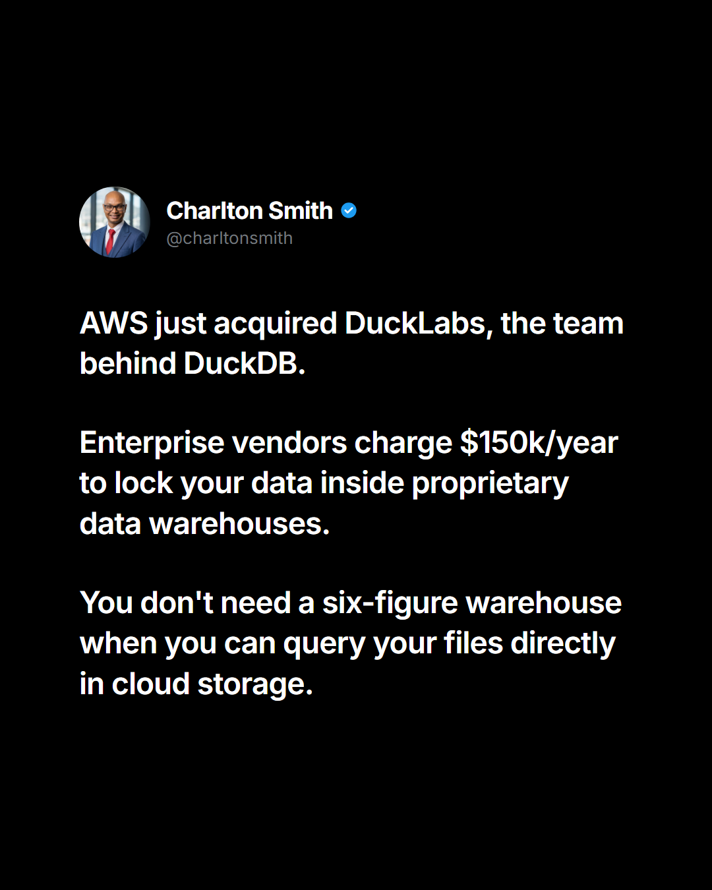

# LinkedIn Post — Story 02: AWS Acquires DuckLabs (Validation of the Lean Lakehouse)
**Author Style**: Tobi Oluwole (Punchy, honest business reflection, zero sales pitch)  
**Deliverable**: 8-Line Top-of-Feed Post + Social Card Image + Strategic 1st Comment  
**Canonical CTA**: [charltonearlsmith.co.za](https://charltonearlsmith.co.za)  

---

### LinkedIn Post Copy (Option 1 — Primary Tobi Style: 8 Lines Max)

AWS just acquired DuckLabs — the team behind DuckDB.

If you don't work in data architecture, here is why that matters:

For years, enterprise cloud vendors told companies:
"If you want real analytics, you must copy your data into our $150,000/year warehouse."

Then they charge you compute fees every time you run a query, and monthly seat taxes just to look at a dashboard.

Meanwhile, we've been building lean analytical engines running directly on raw cloud storage files for pennies.

Some people called it too simple.

Then AWS tested DuckDB on Amazon Quick and watched query latency plunge by 30%.

Now the largest cloud provider on earth just bought the team to turn Amazon S3 into an analytical powerhouse.

You don't need a six-figure data warehouse when you can query your files directly where they already live.

---

### Alternative LinkedIn Post Copy (Option 2 — The CFO / Tech Economics Angle)

The biggest cloud provider in the world just admitted what CFOs have suspected for years:

Enterprise data warehouses are wildly overpriced for what most companies actually need.

AWS just acquired DuckLabs, the team behind DuckDB.

Not to build another complex $200k/year database, but to let companies query their files directly in Amazon S3.

Vendors convinced businesses that before you can run a sales report, you need Snowflake, a pipeline tool, and a six-figure contract.

Meanwhile, the fastest database engine runs right on top of raw Parquet files in simple storage buckets.

Zero compute idle costs. Zero monthly viewer taxes. Sub-second speed.

The future of business intelligence isn't moving your data into proprietary boxes — it's querying it where it already sits.

---

### Accompanying Social Card (1080 × 1350 px, 4:5 Mobile Ratio)

* **Image Source**: [`post_image.png`](file:///c:/Users/G988557/Documents/Code/antigravity/opensourcetransformation/case-studies/02-aws-ducklabs-acquisition/post/post_image.png)
* **HTML Template**: [`post_image.html`](file:///c:/Users/G988557/Documents/Code/antigravity/opensourcetransformation/case-studies/02-aws-ducklabs-acquisition/post/post_image.html)

---

### The Strategic 1st Comment (Drop Within 60 Seconds of Posting)

Here is the breakdown of why AWS pulled the trigger on DuckLabs (and what it means for enterprise teams):

1. **Supercharging Amazon S3**: AWS wants to turn S3 from passive "cold" file storage into an active analytical powerhouse. DuckDB runs vectorized, sub-second SQL queries directly on open Parquet and CSV files already sitting in S3 buckets without needing a separate database cluster.

2. **Proven 30% Latency Drop on Amazon Quick**: Before buying DuckLabs, AWS quietly integrated DuckDB into Amazon Quick. Query latency plunged by 30% while scaling effortlessly across CPUs. They are now rolling this performance boost across SageMaker Lakehouse and S3 Tables.

3. **"Talent and Trust" Acquisition**: AWS didn't just acquire software code — they brought in the 30+ core database engineers who built DuckDB from the ground up to architect the future of cloud analytics.

4. **The Death of the "Warehouse Tax"**: Most mid-market businesses don't need a heavy, expensive data warehouse like Redshift or Snowflake just to see their margins and operational KPIs. Serverless, in-process compute gives you instant speed at 1/100th of the cost.

What's your take — are dedicated cloud data warehouses heading toward the same fate as on-prem servers?
