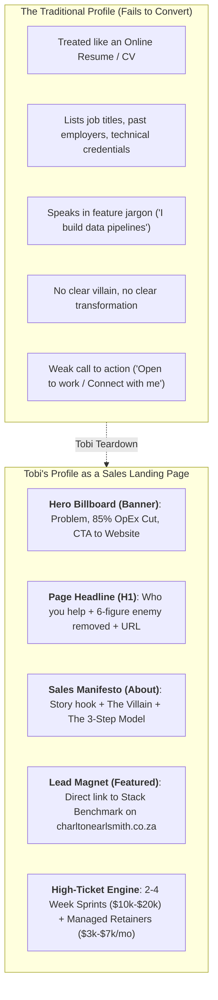
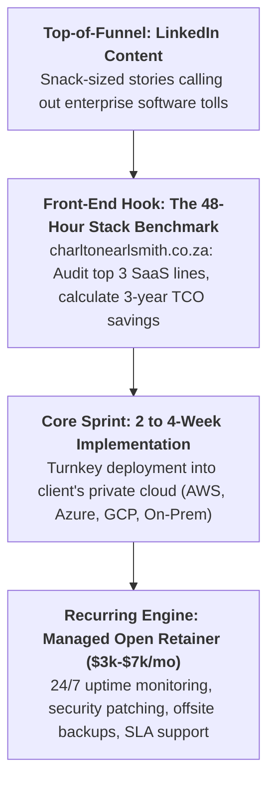

# Revised LinkedIn Strategy: Enterprise Open Source Transformation & Managed Retainers
## Applying Tobi Oluwole’s Profile Teardown & Growth Engine to Charlton Smith

> **Core Directives**:
> 1. **Profile as a Landing Page**: Apply Tobi Oluwole’s live teardown methodology (*"I built a $20k/month LinkedIn strategy for her in 24 minutes"*). The LinkedIn profile is not an online resume or CV—it is a high-converting sales landing page designed to turn C-suite attention into booked stack audits.
> 2. **No Specific Open Source Tool Names**: Never debate or list specific open-source tools (no DuckDB, n8n, SigNoz, Odoo, Twenty, etc.). Focus 100% on **the enterprise SaaS enemy, the business transformation, the rapid implementation sprint, and 24/7 managed retainers**.
> 3. **Expanded Operational Scope**: Transform operations across BI & Reporting, Workflow Automation, CRM & Lead Management, Invoicing & Revenue, Transportation & Logistics, E-Commerce, and Observability.
> 4. **Canonical Lead Mechanism**: Every post, headline, and profile section routes qualified traffic directly to **[charltonearlsmith.co.za](https://charltonearlsmith.co.za)**.

---

## 1. Insights from Tobi Oluwole's Live Client Profile Teardown

In his live client audits (e.g., *"I built a $20k/month LinkedIn strategy for her in 24 minutes"*), Tobi deconstructs why 99% of B2B profiles fail to generate revenue and how to re-architect them:

### Key Principles from Tobi's Client Reviews:
1. **The Headline is your H1 Hook**: Prospects give you 3 seconds. If your headline says *"Data Architect & Consultant"*, you are a commodity. If it says *"Helping mid-market companies eliminate $100k+ in software fees using self-hosted Open Source"*, you are a high-value strategic partner.
2. **Eliminate the "Consultant's Curse" (Over-complicating the tech)**: Clients do not care what database or workflow engine you use. They care that **they stop paying $14/user/month to view dashboards** and **stop getting $3,000 monthly automation overage penalties**.
3. **The $20k–$50k/Month High-Ticket Packaging Math**:
   * Instead of small hourly gigs, package a **Turnkey Transformation Sprint** ($10,000 to $25,000 fixed price) followed by a **Managed Open Infrastructure Retainer** ($3,000 to $7,000/month).
   * Just 4 active retainer clients generate **$15k–$25k/month in recurring, predictable revenue**, completely eliminating the feast-and-famine cycle.

---

## 2. Expanded Operational Transformation Domains

We call out the predatory enterprise software vendor and replace it with production-grade, private-cloud open-source infrastructure:

| Operational Domain | Enterprise SaaS Enemy (Called Out) | The Open Source Business Transformation |
| :--- | :--- | :--- |
| **1. Business Intelligence & Analytics** | Power BI, Tableau, Snowflake, Databricks | Sub-second dashboards and analytical data stores on your private cloud with **zero per-seat viewer taxes**. Cut $100k+ down to bare-metal compute. |
| **2. Workflow Automation & Integration** | Zapier, Make, Workato, MuleSoft | High-volume operational automation pipelines with **unlimited execution steps and zero per-task penalties**. |
| **3. CRM & Lead Management** | Salesforce, HubSpot Enterprise, Zoho CRM | Custom customer relationship and sales pipeline engines with **100% data ownership and zero per-seat user fees**. |
| **4. Invoicing & Revenue Management** | Stripe Billing enterprise tiers, Chargebee, QuickBooks seat locks | Self-hosted recurring billing, subscription handling, and multi-currency invoicing with **zero platform percentage take-rates**. |
| **5. Transportation, Fleet & Logistics** | Samsara, Geotab, proprietary TMS platforms | Live GPS tracking, delivery dispatch routing, order manifests, and fleet telemetry with **zero monthly per-vehicle software fees**. |
| **6. E-Commerce & Digital Commerce** | Shopify Plus ($2,500/mo + % cut), Adobe Commerce (Magento) | Headless B2B wholesale portals and digital storefronts with **complete customer database ownership and zero transaction cuts**. |
| **7. Infrastructure Monitoring & Logs** | Datadog, New Relic, Splunk | Unified observability, error tracking, and server performance metrics with **zero unpredictable volume spike invoices**. |
| **8. Internal Portals & Operational Tools** | Retool Enterprise, custom proprietary apps | Custom frontline inventory screens, dispatch tablets, and operational dashboards with **zero user license caps**. |

---

## 3. The 3-Tier Commercial Delivery Flywheel

1. **Front-End Hook (Free Stack Benchmark)**:
   * Prospect visits **[charltonearlsmith.co.za](https://charltonearlsmith.co.za)**.
   * Enters top 3 SaaS contracts (e.g., Salesforce + Power BI + Zapier).
   * Receives an authoritative 3-year Total Cost of Ownership (TCO) breakdown showing projected 85% OpEx reduction.
2. **The Turnkey Implementation Sprint (Fixed-Price Project)**:
   * Duration: 2 to 4 weeks.
   * Full private cloud provisioning, security hardening, data migration, and team onboarding.
   * Delivered fully operational with zero technical jargon.
3. **The Managed Infrastructure Retainer (Recurring Monthly Engine)**:
   * Provides the enterprise safety net: *"Who maintains this when it breaks?"*
   * 24/7 uptime monitoring, automated failover, daily snapshots, software updates, and SLA support.

---

## 4. Tobi-Style Post Fingerprint & Content Rules

* **Posting Schedule**: Every weekday morning at **08:00 AM local time**.
* **Length**: Strictly **8 to 12 lines**.
* **Cadence**: Exactly **one thought per line** with breathable whitespace.
* **No Open Source Names**: Mention only the capability and the enterprise vendor being disrupted.
* **Direct Lead Destination**: Every post ends with an invitation to benchmark their stack at **[charltonearlsmith.co.za](https://charltonearlsmith.co.za)**.
