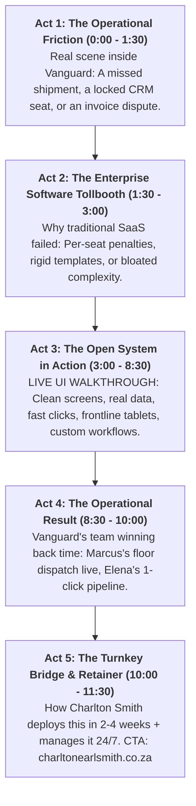
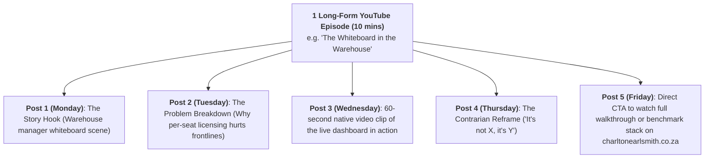

# Charlton Earl Smith — YouTube Narrative Engine & Channel Strategy
## High-Ticket B2B Acquisition: Eliminating Operational Friction in a Fictional Business

> **Channel Objective**: Attract, educate, and convert busy mid-market business owners, COOs, and managing directors (50–500 employees).  
> **Key Metric**: Not vanity views or virality, but **qualified pipeline velocity, executive trust, and operational audit inquiries at [charltonearlsmith.co.za](https://charltonearlsmith.co.za)**.  
> **Core Format Rule**: **Strictly NO CLI, terminal commands, bash scripts, or GitHub install tutorials.** The videos focus 100% on **real operational problem-solving, eliminating business process bottlenecks, and winning back time** in the daily life of a fictional growing company (**Vanguard Supply Co.**).
> **Delivery Engine**: Appleify Automation — Diagnosing, streamlining, and managing background operations 24/7.

---

## 1. The Fictional Business Universe: "Vanguard Supply Co."

To make abstract software concepts visceral, tangible, and instantly relatable to business owners, all videos are set within a fictional mid-market company:

```
+---------------------------------------------------------------------------------------+
| COMPANY PROFILE: VANGUARD SUPPLY & DISTRIBUTION CO.                                   |
+---------------------------------------------------------------------------------------+
| • Headcount: 135 employees across 2 regional distribution centers and a head office.  |
| • Revenue: $35M annual turnover.                                                      |
| • Business Model: B2B wholesale distributor of industrial parts and commercial goods. |
| • The Pain: Outgrowing basic tools, trapped in rigid enterprise SaaS contracts,       |
|   facing per-seat license taxes, manual spreadsheets, and disconnected data silos.    |
+---------------------------------------------------------------------------------------+
```

### Recurring Characters (The Executive Archetypes):

1. **David (Managing Director / Owner)**:
   * *Profile*: Pragmatic, time-poor, protective of company culture.
   * *Frustration*: Tired of signing 15% annual SaaS renewal price hikes and seeing his leadership team waste hours fighting software instead of serving customers.
2. **Marcus (Head of Operations & Logistics)**:
   * *Profile*: Frontline operator, runs the warehouse floor and dispatch fleet.
   * *Frustration*: Warehouse tablets cut off because IT rationed user seats; dispatch drivers logging delivery manifests on paper; inventory counts always 24 hours out of date.
3. **Elena (Head of Commercial & Sales)**:
   * *Profile*: High-energy, drives wholesale accounts and rep performance.
   * *Frustration*: Enterprise CRM takes 14 clicks just to log a customer call; sales reps refusing to update deals; zero visibility on actual client order history.
4. **Robert (Finance Director / CFO)**:
   * *Profile*: Detail-oriented, risk-averse.
   * *Frustration*: Surprise monthly overage bills from automation tools and monitoring platforms; CFO dreading every contract renewal.

---

## 2. The Video Blueprint: "The Operational Rescue" (8–12 Minutes)

Each episode follows a proven 5-act narrative structure that mirrors high-ticket B2B case studies:



### What We Show vs. What We NEVER Show:

| ❌ What We NEVER Show (DIY Developer Content) | ✅ What We ALWAYS Show (Executive Business Content) |
| :--- | :--- |
| `docker run` or `docker-compose.yml` code | The clean, modern end-user web dashboard. |
| Terminal commands, Linux shells, or SSH prompts | The frontline warehouse supervisor clicking an order on a wall tablet. |
| Debates on open-source framework names or GitHub repos | The speed of data filtering across 50,000 SKUs in under 200ms. |
| Package manager errors or configuration files | The seamless integration: sales order triggers packing manifest automatically. |
| "Here's how to configure your reverse proxy" | "Here's how David's leadership team won back 15 hours a week." |

---

## 3. Season 1 Episode Roadmap (The 6 Transformation Stories)

### Episode 1: "The Whiteboard in the Warehouse" (BI & Analytics)
* **The Vanguard Drama**: Marcus has a 4-foot physical whiteboard in Warehouse 2 tracking $250k of urgent retail shipments. The CEO asks why it’s not on screens. Answer: Power BI user seats were capped by corporate IT to avoid a $60,000 enterprise license tier.
* **The Software Walkthrough**: A high-speed, web-based analytical portal running directly on Vanguard’s private cloud storage. Zero license logins. Live inventory and OTIF tracking displayed on 65-inch warehouse screens.
* **The Outcome**: Frontline supervisors have instant visibility; stock-outs drop by 40%; $0 in per-seat viewer taxes.

### Episode 2: "The 40,000-Order Tollbooth" (Workflow Automation)
* **The Vanguard Drama**: Black Friday and seasonal rush hit. Vanguard's B2B orders double, but their workflow automation SaaS provider halts all order processing because they exceeded their monthly "task quota." The upgrade quote is $4,500/month.
* **The Software Walkthrough**: Vanguard’s private-cloud automation engine. Live walkthrough of an end-to-end order flow: ERP webhook $\rightarrow$ inventory reservation $\rightarrow$ warehouse pick ticket $\rightarrow$ customer SMS dispatch. Zero task meters.
* **The Outcome**: 100,000 automated workflow executions a week with zero overage penalties.

### Episode 3: "The 14-Click Pipeline" (CRM & Lead Management)
* **The Vanguard Drama**: Elena discovers her 8 sales reps are tracking major wholesale bids in personal Excel spreadsheets. Why? Their enterprise CRM has 45 required fields, lags on mobile, and costs $150/user/month.
* **The Software Walkthrough**: A clean, lightning-fast CRM built for wholesale distribution. 1-click stage updates, integrated email history, and customer buying trends visible in one unified card.
* **The Outcome**: 100% CRM adoption across the sales team; sales meetings cut from 2 hours to 20 minutes; full customer data owned by Vanguard.

### Episode 4: "Where Are The Trucks?" (Fleet & Logistics)
* **The Vanguard Drama**: Vanguard operates 45 delivery trucks. Customer service is overwhelmed with phone calls asking for delivery ETAs. The enterprise telematics vendor wants $50/month per truck plus a 3-year hardware lock-in just to share tracking links.
* **The Software Walkthrough**: Vanguard's private-cloud fleet and logistics portal. Live map with real-time GPS telemetry, automatic customer dispatch SMS with live driver arrival times, and proof-of-delivery signature capture.
* **The Outcome**: Customer "where is my order" calls drop by 80%; fleet routes optimized; zero per-vehicle software fees.

### Episode 5: "The Percentage Heist" (Invoicing & Revenue Management)
* **The Vanguard Drama**: Robert notices that their online wholesale payment portal is shaving 1.2% off every recurring trade account payment, costing Vanguard $3,800 every month just to send automated PDFs and collect ACH/card payments.
* **The Software Walkthrough**: Vanguard's self-hosted billing and revenue portal. Multi-currency automated invoicing, automated payment reminders, direct accounting ledger reconciliation, and zero platform percentage cuts.
* **The Outcome**: 100% of revenue hits Vanguard's bank account; automated dunning recovers overdue trade accounts without awkward phone calls.

### Episode 6: "The 2:00 AM Crash (Who Fixes It?)" (Managed Retainer & Observability)
* **The Vanguard Drama**: David's #1 fear: *"What happens if this open-source stack goes down over the weekend? I don't have a 24/7 DevOps team."*
* **The Walkthrough**: Inside Charlton Smith’s Managed Operations Center. Showing the automated health monitoring, automated backups, instant failover, and SLA response.
* **The Outcome**: How Vanguard runs enterprise-grade infrastructure with fractional support at 1/5th the cost of hiring an in-house DevOps engineer.

---

## 4. The YouTube-to-LinkedIn Content Multiplier Engine

Every 10-minute YouTube video becomes the foundational asset for **10 days of LinkedIn content**:



---

## 5. Production & Channel Setup Guidelines

* **Channel Name**: **Charlton Smith**
* **Channel Tagline**: *Enterprise Open Source for Mid-Market Business*
* **Video Thumbnails**:
  * High-contrast executive aesthetic (Navy `#002D62`, Royal Blue `#0075C9`, Clean White typography).
  * Direct problem-oriented headline: *"Why His Warehouse Used a Whiteboard"*, *"The $4,500 Automation Trap"*, *"Salesforce Was Slowing Them Down"*.
  * No generic clickbait facial expressions; clean, authoritative, documentary-style framing.
* **Pinned Comment & Description Template**:
  ```text
  We help busy mid-market companies (50–500 staff) replace rigid enterprise software with fast, tailored Open Source systems—deployed in 2 to 4 weeks and managed 24/7.
  
  👉 Benchmark your current software stack and operations:
  https://charltonearlsmith.co.za
  ```
