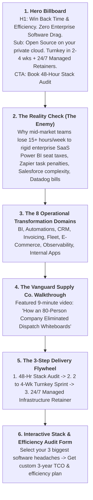

# charltonearlsmith.co.za — High-Converting Executive Website Funnel
## Strategic Blueprint & Page Wireframe

> **Goal**: Convert busy mid-market executives (CEOs, COOs, Managing Directors) from LinkedIn posts and YouTube walkthroughs into booked **Stack & Efficiency Audits**.  
> **Key Metric**: Audit conversion rate (not generic site visitors).  
> **Aesthetic**: Premium corporate executive (Deep Navy `#002D62`, Royal Blue `#0075C9`, Vibrant Cyan `#00A3E0`, Crisp White `#FFFFFF`). Clean, lightning-fast load time, zero clutter.

---

## 1. Page Flow Architecture (Single-Page Executive Funnel)

---

## 2. Copywriting & Section Breakdown

### Section 1: Above-the-Fold Hero
* **Eyebrow Badge**: `ENTERPRISE OPEN SOURCE TRANSFORMATION`
* **Headline (H1)**:
  # Win Back Time & Operational Efficiency.
  ### Zero Enterprise Software Drag.
* **Sub-headline**:
  *We help growing mid-market companies (50–500 staff) replace rigid, overpriced enterprise software with clean, fast Open Source systems—tailored to your exact workflow, deployed in 2 to 4 weeks, and managed 24/7.*
* **Primary CTA**: `[ Book Your 48-Hour Stack & Efficiency Audit → ]` (Scrolls to Form)
* **Trust Badges**:
  `✔ Zero Per-Seat User Limits` · `✔ 100% Private Cloud Data Ownership` · `✔ 24/7 Managed Retainer Support`

---

### Section 2: The Enterprise Software Drag (Calling Out The Enemy)
* **Header**: **You Didn’t Build Your Business to Fit Inside a Software Vendor's Rigid Box.**
* **The Problem Grid (3 Pain Cards)**:
  1. **The Seat License Rationing Tax**:
     * *The Pain*: Your warehouse dispatchers and frontline staff are forced to use handwritten whiteboards or stale spreadsheets because corporate IT hit the license cap on Power BI or Salesforce.
     * *The Fix*: Unlimited users and wall-mounted touchscreens with zero per-seat viewer taxes.
  2. **The Growth Penalties (Task & Volume Meters)**:
     * *The Pain*: Every time your sales pipeline closes more deals or your order volume surges, your workflow automation tools and monitoring platforms slap you with surprise monthly overage bills.
     * *The Fix*: High-capacity automation and monitoring running on your own private cloud with zero per-task fees.
  3. **The 14-Click Feature Bloat**:
     * *The Pain*: Paying for complex enterprise software where 80% of the features are never touched, while the 20% your team actually needs requires 10 clicks and endless workarounds.
     * *The Fix*: Clean, custom web portals built around your exact operational steps.

---

### Section 3: The 8 Operational Transformation Domains
*Interactive grid showcasing the business capabilities and proprietary vendors replaced:*

1. **Business Intelligence & Reporting** (Replaces: Power BI, Snowflake, Tableau)
2. **Workflow Automation & Integration** (Replaces: Zapier, Make, Workato)
3. **CRM & Lead Management** (Replaces: Salesforce, HubSpot Enterprise)
4. **Invoicing & Revenue Management** (Replaces: Stripe Billing add-ons, Chargebee, QuickBooks seat locks)
5. **Transportation, Fleet & Logistics** (Replaces: Samsara, Geotab, proprietary TMS)
6. **E-Commerce & Wholesale Commerce** (Replaces: Shopify Plus, Adobe Commerce)
7. **Infrastructure Monitoring & Observability** (Replaces: Datadog, New Relic)
8. **Internal Portals & Operational Tools** (Replaces: Retool Enterprise, custom apps)

---

### Section 4: Video Case Study (The Narrative Walkthrough)
* **Title**: **See It in Action: How Vanguard Supply Co. Eliminated Dispatch Chaos**
* **Embed**: Episode 1 YouTube Video (*"The Whiteboard in the Warehouse"*).
* **Copy**: *Watch an actual 9-minute walkthrough of a live open-source analytics and dispatch portal in the daily operations of a $35M distributor. No terminal commands. No developer jargon. Just fast, simple operational clarity.*

---

### Section 5: The 3-Step Delivery Flywheel
1. **Step 1: The 48-Hour Stack & Efficiency Audit (Free)**
   * We review your top 3 software expense lines and operational bottlenecks. We project your exact time savings and 3-year TCO reduction.
2. **Step 2: The Turnkey Implementation Sprint (2 to 4 Weeks)**
   * We deploy the open-source infrastructure inside your private cloud (AWS, Azure, GCP, or on-premise), migrate your data, customize your workflows, and onboard your team.
3. **Step 3: The Managed Infrastructure Retainer (Ongoing Peace of Mind)**
   * We operate as your fractional infrastructure partner. 24/7 uptime monitoring, security patching, daily offsite backups, and SLA support so leadership never worries about IT.

---

### Section 6: Interactive Stack Audit Booking Form
* **Fields**:
  * Name & Work Email
  * Company Name & Employee Count
  * **Operational Problem / Issue**: Open text area asking: *"What is the operational problem or issue you need help with right now?"* (e.g., warehouse whiteboard tracking, Zapier billing overages, CRM sales friction).
* **CTA Button**: `[ Request Your 48-Hour Stack Audit → ]`
